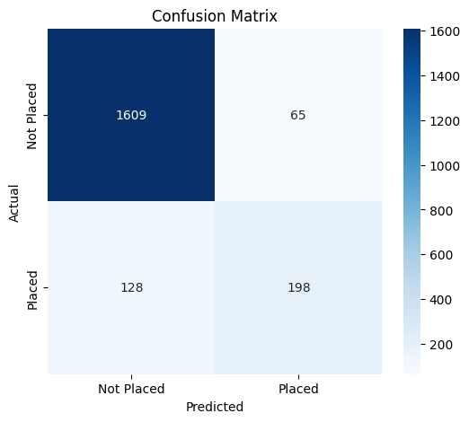

# 🎓 College Student Placement Analysis

## Project Overview

This project uses machine learning to predict whether a college student will be placed based on academic performance, communication skills, internship experience, projects completed, and other student attributes.

---

## Dataset

The dataset contains information on 10,000 students, including:

- IQ
- Previous Semester Result
- CGPA
- Academic Performance
- Internship Experience
- Extra Curricular Score
- Communication Skills
- Projects Completed
- Placement Status

---

## Tools Used

- Python
- Pandas
- NumPy
- Matplotlib
- Seaborn
- Scikit-learn
- Google Colab

---

## Machine Learning Model

Logistic Regression

---

## Model Performance

Accuracy:

**89.1%**

Classification Report:

- Precision (Placed): 0.70
- Recall (Placed): 0.57
- F1-score (Placed): 0.63

---

## Confusion Matrix

*(Insert confusion matrix image here after uploading it.)*



---

## Key Findings

- Higher CGPA generally increases placement chances.
- Internship experience positively influences placement.
- Strong communication skills improve employability.
- Students completing more projects tend to perform better.

---

## Repository Structure

```
student-placement-analysis/
│
├── data/
├── images/
├── notebooks/
└── README.md
```

---

## Author

**Caroline Murithi**

Bachelor of Business Information Technology (BBIT)

Aspiring Data Analyst | Python | SQL | Power BI
